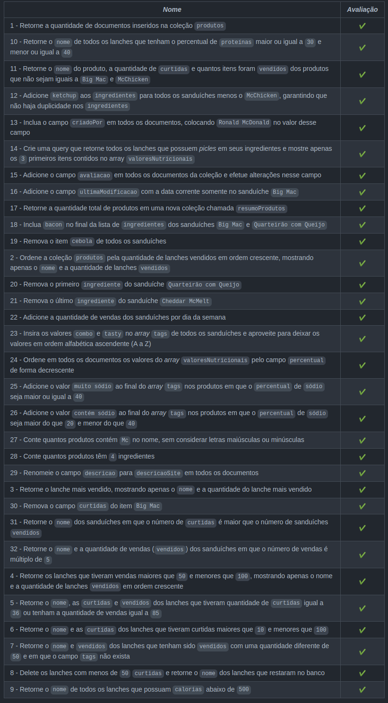

# Project MongoDB COmmerce

Esse projeto foi desenvolvido por mim ([Igor Leal](www.linkedin.com/in/igorlealh)) utilizando MongoDB e Docker.
Nele pratiquei todos os conceitos sobre Mongo ensinados durante os blocos 30.1 e 30.2 do módulo de Back-end da [Trybe](https://www.betrybe.com/)!

Foi usado o banco de dados commerce, que contém dados do cardápio do McDonald's, como ingredientes, valores nutricionais e dados fictícios de vendas.

No total foram 32 requisitos e obtive 100% de aprovação.

### Desafios
> A resolução de cada desafio está dentro do diretório `challenges` em cada um dos seus respectivos arquivos.

